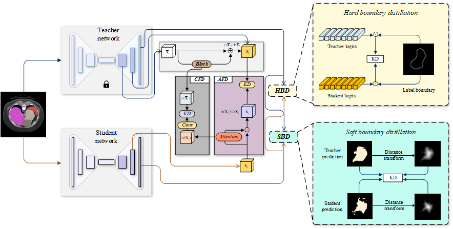

# Attention Correction Feature and Boundary Constraint Knowledge Distillation for Efficient Medical Image Segmentation

A pytorch implenment for Attention Correction Feature and Boundary Constraint Knowledge Distillation for Efficient Medical Image Segmentation

# Overview of our ACF-BCKD



# Directory

- [Requirement](#requirement)
  - [MMCV](#mmcv)
  - [Other required package](#other-required-package)
- [Datasets](#datasets)
  - [BTCV](#btcv)
  - [WORD](#word)
  - [BraTS](#brats21)
- [Training and testing](#training-and-testing)
  - [Checkpoints](#checkpoints)
  - [Commands](#commands)
- [Results](#results)
    - [Our distillation performance](#our-performance)
    - [Comparision](#comparision-with-other-distillation-methods)
      - [BTCV](#btcv-and-word-dataset)
      - [BraTS21](#brats21)
- [Acknowledgement](#acknowledgement)
- [Citation](#citation)
- [License](#license)

# Requirement
- Pytorch >= 1.12.0
- MMCV
- MMEngine
- MMSeg
- MMRazor
- MONAI
## MMCV
This repo is required the MMCV, it can be simply install by:

```pycon
pip install -U openmim
mim install mmcv
```

## Other required package
We have a lot of required package listed in [here](requirements.txt).

You can simply run the following script to install the required package:

```pycon
pip install -r requirements.txt
```

# Datasets

## BTCV

You counld get BTCV raw data from [here](https://www.synapse.org/#!Synapse:syn3193805/wiki/217752 "https://www.synapse.org/#!Synapse:syn3193805/wiki/217752").

## WORD
You counld get WORD raw data from this [repo](https://github.com/HiLab-git/LCOVNet-and-KD?tab=readme-ov-file#dataset).

## BraTS
You counld get BraTS raw data from [here](https://www.synapse.org/#!Synapse:syn51156910/wiki/622351). 

Be ware that we use the BraTS21 in the paper, and it's same as the link, which named BraTS Continuous Evaluation Challenge or BraTS23.

# Training and testing

## Checkpoints

You can download the pretrained teacher checkpoints from this [url](https://drive.google.com/drive/folders/1TJYwsQZz-Zqs4qjq8wyfp7B0dvre4tUT?usp=drive_link). Put them into your project directory.

## Commands
-   Training on one GPU:

```pycon
python train.py {config}
```

-   Testing on one GPU:

```pycon
python test.py {config}
```
{config} means the config path. The config path can be found in [configs](configs "configs"),
or you can find them in the last column of the following tables.
# Results

## Our performance

| Networks           | BTCV       |            |           | WORD       |            |           | BraTS21    |            |           |
| ------------------ | ---------- | ---------- | --------- | ---------- | ---------- | --------- | ---------- | ---------- | --------- |
|                    | Dice (%)   | HD95 (mm)  | Config    | Dice (%)   | HD95 (mm)  | Config    | Dice (%)   | HD95 (mm)  | Config    |
| Teachers           |            |            |           |            |            |           |            |            |           |
| T1: ResU-Net       | 81.37±0.25 | 11.22±2.24 | [config](configs/unet/unetmod_base_d8_1000e_sgd_synapse_96x96x96.py) | 84.11±0.08 | 9.12±0.77  | [config](configs/unet/unetmod_base_d8_300e_sgd_word_96x96x96.py) | 89.77±0.08 | 6.75±0.75  | [config](configs/unet/unetmod_base_d8_100e_sgd_brats21_96x96x96.py) |
| T2: SegResNet      | 80.69±0.34 | 9.18±5.60  | [config](configs/segresnet/segresnet_1000e_sgd_synapse_96x96x96.py) | 83.44±0.07 | 9.32±0.46  | [config](configs/segresnet/segresnet_300e_sgd_word_96x96x96.py) | 89.67±0.54 | 8.30±1.12  | [config](configs/segresnet/segresnet_100e_sgd_brats23_96x96x96.py) |
| U-Net [8]         | 65.08±0.87 | 31.55±2.56 | [config](configs/unet/unetmod_tiny_d8_1000e_sgd_synapse_96x96x96.py) | 77.25±0.69 | 26.85±2.36 | [config](configs/unet/unetmod_tiny_d8_300e_sgd_word_96x96x96.py) | 85.74±0.11 | 13.39±0.71 | [config](configs/unet/unetmod_tiny_d8_50e_sgd_brats21_96x96x96.py) |
| T1: w/             | 76.28±0.26 | 12.57±1.02 | [config](configs/distill/acf_bckd/loghdkd_bkdv1_exkd_v16_unet_base_d8_unet_tiny_d8_1000e_sgd_synapse_96x96x96.py) | 80.87±0.11 | 14.03±0.54 | [config](configs/distill/acf_bckd/loghdkd_bkdv1_exkd_v16_unet_base_d8_unet_tiny_d8_300e_sgd_word_96x96x96.py) | 88.36±0.05 | 7.42±0.28  | [config](configs/distill/acf_bckd/loghdkd_bkdv1_exkd_v16_unet_base_d8_unet_tiny_d8_50e_sgd_brats23_96x96x96.py) |
| T2: w/             | 76.33±0.43 | 15.09±2.56 | [config](configs/distill/acf_bckd/loghdkd_bkdv1_exkd_v16_segresnet_unet_tiny_d8_1000e_sgd_synapse_96x96x96.py) | 80.77±0.05 | 14.59±2.01 | [config](configs/distill/acf_bckd/loghdkd_bkdv1_exkd_v16_segresnet_unet_tiny_d8_300e_sgd_word_96x96x96.py) | 87.37±0.12 | 8.27±0.39  | [config](configs/distill/acf_bckd/loghdkd_bkdv1_exkd_v16_segresnet_unet_tiny_d8_50e_sgd_brats23_96x96x96.py) |
| ESPNetV2 [20]     | 59.35±3.22 | 33.51±1.77 | [config](configs/espnetv2/espnetv2_1000e_sgd_synapse_96x96x96.py) | 66.45±3.51 | 27.83±3.37 | [config](configs/espnetv2/espnetv2_300e_sgd_word_96x96x96.py) | 71.63±3.17 | 19.84±3.09 | [config](configs/espnetv2/espnetv2_50e_sgd_brats23_96x96x96.py) |
| T1: w/             | 69.61±1.64 | 16.44±4.29 | [config](configs/distill/acf_bckd/loghdkd_bkdv1_exkd_v16_unet_base_d8_espnetv2_1000e_sgd_synapse_96x96x96.py) | 76.03±1.09 | 13.21±1.88 | [config](configs/distill/acf_bckd/loghdkd_bkdv1_exkd_v16_unet_base_d8_espnetv2_300e_sgd_word_96x96x96.py) | 81.90±0.77 | 8.57±0.44  | [config](configs/distill/acf_bckd/loghdkd_bkdv1_exkd_v16_unet_base_d8_espnetv2_50e_sgd_brats23_96x96x96.py) |
| T2: w/             | 74.35±0.31 | 11.36±0.65 | [config](configs/distill/acf_bckd/loghdkd_bkdv1_exkd_v16_segresnet_espnetv2_1000e_sgd_synapse_96x96x96.py) | 76.30±0.55 | 10.32±0.36 | [config](configs/distill/acf_bckd/loghdkd_bkdv1_exkd_v16_segresnet_espnetv2_300e_sgd_word_96x96x96.py) | 82.17±0.17 | 9.07±0.59  | [config](configs/distill/acf_bckd/loghdkd_bkdv1_exkd_v16_segresnet_espnetv2_50e_sgd_brats23_96x96x96.py) |
| Mobile U-Net [22] | 77.62±0.13 | 11.41±0.45 | [config](configs/mobile_unet/mobileunet_1000e_sgd_synapse_96x96x96.py) | 80.93±0.26 | 10.45±0.33 | [config](configs/mobile_unet/mobileunet_300e_sgd_word_96x96x96.py) | 88.34±0.21 | 7.60±0.32  | [config](configs/mobile_unet/mobileunet_50e_sgd_brats23_96x96x96.py) |
| T1: w/             | 78.48±0.32 | 7.16±1.86  | [config](configs/distill/acf_bckd/loghdkd_bkdv1_exkd_v16_unet_base_d8_mobileunet_1000e_sgd_synapse_96x96x96.py) | 82.23±0.09 | 8.62±0.26  | [config](configs/distill/acf_bckd/loghdkd_bkdv1_exkd_v16_unet_base_d8_mobileunet_300e_sgd_word_96x96x96.py) | 89.05±0.10 | 5.52±0.24  | [config](configs/distill/acf_bckd/loghdkd_bkdv1_exkd_v16_unet_base_d8_mobileunet_50e_sgd_brats23_96x96x96.py) |
| T2: w/             | 79.05±0.33 | 6.83±2.07  | [config](configs/distill/acf_bckd/loghdkd_bkdv1_exkd_v16_segresnet_mobileunet_1000e_sgd_synapse_96x96x96.py) | 82.23±0.06 | 8.29±0.14  | [config](configs/distill/acf_bckd/loghdkd_bkdv1_exkd_v16_segresnet_mobileunet_300e_sgd_word_96x96x96.py) | 88.95±0.18 | 5.77±0.05  | [config](configs/distill/acf_bckd/loghdkd_bkdv1_exkd_v16_segresnet_mobileunet_50e_sgd_brats23_96x96x96.py) |
| LCOV-Net [23]     | 77.78±0.44 | 9.76±0.70  | [config](configs/lcovnet/lcovnet_1000e_sgd_synapse_96x96x96.py) | 81.75±0.15 | 14.71±0.95 | [config](configs/lcovnet/lcovnet_300e_sgd_word_96x96x96.py) | 88.82±0.23 | 7.28±0.57  | [config](configs/lcovnet/lcovnet_50e_sgd_brats23_96x96x96.py) |
| T1: w/             | 79.12±0.24 | 8.38±0.69  | [config](configs/distill/acf_bckd/loghdkd_bkdv1_exkd_v16_unet_base_d8_lcovnet_1000e_sgd_synapse_96x96x96.py) | 83.10±0.12 | 10.58±2.25 | [config](configs/distill/acf_bckd/loghdkd_bkdv1_exkd_v16_unet_base_d8_lcovnet_300e_sgd_word_96x96x96.py) | 89.21±0.24 | 5.47±0.40  | [config](configs/distill/acf_bckd/loghdkd_bkdv1_exkd_v16_unet_base_d8_lcovnet_50e_sgd_brats23_96x96x96.py) |
| T2: w/             | 79.77±0.39 | 9.01±1.01  | [config](configs/distill/acf_bckd/loghdkd_bkdv1_exkd_v16_segresnet_lcovnet_1000e_sgd_synapse_96x96x96.py) | 81.91±0.18 | 8.86±0.22  | [config](configs/distill/acf_bckd/loghdkd_bkdv1_exkd_v16_segresnet_lcovnet_300e_sgd_word_96x96x96.py) | 89.34±0.11 | 5.65±0.22  | [config](configs/distill/acf_bckd/loghdkd_bkdv1_exkd_v16_segresnet_lcovnet_50e_sgd_brats23_96x96x96.py) |

## Comparision with other distillation methods
### BTCV and WORD dataset
| Networks       |                     | BTCV           |                |           | WORD           |                |           |
| -------------- | ------------------- | -------------- | -------------- | --------- | -------------- | -------------- | --------- |
|                |                     | Dice (%)       | HD95 (mm)      | Config    | Dice (%)       | HD95 (mm)      | Config    |
|         |   Student                  | 65.08±0.87     | 31.55±2.56     |  [config](configs/unet/unetmod_tiny_d8_1000e_sgd_synapse_96x96x96.py)         | 77.25±0.69     | 26.85±2.36     |   [config](configs/unet/unetmod_tiny_d8_300e_sgd_word_96x96x96.py)        |
| T1: ResU-Net   | Teacher             | 81.37±0.25     | 11.22±2.24     |   [config](configs/unet/unetmod_base_d8_1000e_sgd_synapse_96x96x96.py)        | 84.11±0.08     | 9.12±0.77      |   [config](configs/unet/unetmod_base_d8_300e_sgd_word_96x96x96.py)        |
|                | KD                  | 68.39±2.01     | 26.49±0.32     | [config](configs/distill/kd/kd_unet_base_d8_unet_tiny_d8_1000e_sgd_synapse_96x96x96.py) | 78.11±0.28     | 36.19±12.4     | [config](configs/distill/kd/kd_unet_base_d8_unet_tiny_d8_300e_sgd_word_96x96x96.py) |
|                | AT                  | 68.68±3.59     | 29.25±3.39     | [config](configs/distill/at/at_unet_base_d8_unet_tiny_d8_1000e_sgd_synapse_96x96x96.py) | 78.59±0.40     | 26.12±1.33     | [config](configs/distill/at/at_unet_base_d8_unet_tiny_d8_300e_sgd_word_96x96x96.py) |
|                | NKD                 | 68.17±3.32     | 14.32±2.15     | [config](configs/distill/nkd/nkd_unet_base_d8_unet_tiny_d8_1000e_sgd_synapse_96x96x96.py) | 77.81±0.16     | 27.67±1.67     | [config](configs/distill/nkd/nkd_unet_base_d8_unet_tiny_d8_300e_sgd_word_96x96x96.py) |
|                | SKD                 | 69.88±1.75     | 14.49±2.13     | [config](configs/distill/skd/skd_unet_base_d8_unet_tiny_d8_1000e_sgd_synapse_96x96x96.py) | 80.19±0.11     | 14.87±0.76     | [config](configs/distill/skd/skd_unet_base_d8_unet_tiny_d8_300e_sgd_word_96x96x96.py) |
|                | IFVD                | 71.44±0.41     | 23.54±1.85     | [config](configs/distill/ifvd/ifvd_unet_base_d8_unet_tiny_d8_1000e_sgd_synapse_96x96x96.py) | 77.80±0.30     | 23.85±1.80     | [config](configs/distill/ifvd/ifvd_unet_base_d8_unet_tiny_d8_300e_sgd_word_96x96x96.py) |
|                | CWD                 | 75.84±0.19     | 24.79±2.86     | [config](configs/distill/cwd/cwd_unet_base_d8_unet_tiny_d8_1000e_sgd_synapse_96x96x96.py) | 79.72±0.05     | 23.64±0.77     | [config](configs/distill/cwd/cwd_unet_base_d8_unet_tiny_d8_300e_sgd_word_96x96x96.py) |
|                | DIST                | 74.84±0.72     | 15.41±2.60     | [config](configs/distill/dist/dist_unet_base_d8_unet_tiny_d8_1000e_sgd_synapse_96x96x96.py) | 80.43±0.23     | 16.67±1.52     | [config](configs/distill/dist/dist_unet_base_d8_unet_tiny_d8_300e_sgd_word_96x96x96.py) |
|                | DKD                 | 71.36±0.53     | 12.61±0.62     | [config](configs/distill/dkd/dkd_unet_base_d8_unet_tiny_d8_1000e_sgd_synapse_96x96x96.py) | 77.87±0.08     | 20.06±0.12     | [config](configs/distill/dkd/dkd_unet_base_d8_unet_tiny_d8_300e_sgd_word_96x96x96.py) |
|                | CIRKD               | 73.08±0.53     | 24.22±1.45     | [config](configs/distill/cirkd/cirkd_unet_base_d8_unet_tiny_d8_1000e_sgd_synapse_96x96x96.py) | 77.58±2.67     | 21.76±1.77     | [config](configs/distill/cirkd/cirkd_unet_base_d8_unet_tiny_d8_300e_sgd_word_96x96x96.py) |
|                | **ACF-BCKD (Ours)** | **76.28±0.26** | **12.57±1.02** | [config](configs/distill/acf_bckd/loghdkd_bkdv1_exkd_v16_unet_base_d8_unet_tiny_d8_1000e_sgd_synapse_96x96x96.py) | **80.87±0.11** | **14.03±0.54** | [config](configs/distill/acf_bckd/loghdkd_bkdv1_exkd_v16_unet_base_d8_unet_tiny_d8_300e_sgd_word_96x96x96.py) |
| T2: SegResNet  | Teacher             | 80.69±0.34     | 9.18±5.60      | [config](configs/segresnet/segresnet_1000e_sgd_synapse_96x96x96.py) | 83.44±0.07     | 9.32±0.46      | [config](configs/segresnet/segresnet_300e_sgd_word_96x96x96.py) |
|                | KD                  | 65.82±0.32     | 25.52±2.07     | [config](configs/distill/kd/kd_segresnet_unet_tiny_d8_1000e_sgd_synapse_96x96x96.py) | 77.61±1.83     | 23.08±2.50     | [config](configs/distill/kd/kd_segresnet_unet_tiny_d8_300e_sgd_word_96x96x96.py) |
|                | AT                  | 66.14±2.75     | 35.26±5.92     | [config](configs/distill/at/at_segresnet_unet_tiny_d8_1000e_sgd_synapse_96x96x96.py) | 78.53±0.29     | 26.34±2.59     | [config](configs/distill/at/at_segresnet_unet_tiny_d8_300e_sgd_word_96x96x96.py) |
|                | NKD                 | 64.75±0.41     | 15.92±2.44     | [config](configs/distill/nkd/nkd_segresnet_unet_tiny_d8_1000e_sgd_synapse_96x96x96.py) | 78.05±0.05     | 22.14±2.33     | [config](configs/distill/nkd/nkd_segresnet_unet_tiny_d8_300e_sgd_word_96x96x96.py) |
|                | SKD                 | 69.60±1.54     | 16.27±3.88     | [config](configs/distill/skd/skd_segresnet_unet_tiny_d8_1000e_sgd_synapse_96x96x96.py) | 79.14±0.02     | 17.08±1.46     | [config](configs/distill/skd/skd_segresnet_unet_tiny_d8_300e_sgd_word_96x96x96.py) |
|                | IFVD                | 64.95±0.32     | 34.44±2.66     | [config](configs/distill/ifvd/ifvd_segresnet_unet_tiny_d8_1000e_sgd_synapse_96x96x96.py) | 65.70±4.43     | 34.17±3.68     | [config](configs/distill/ifvd/ifvd_segresnet_unet_tiny_d8_300e_sgd_word_96x96x96.py) |
|                | CWD                 | 75.76±0.39     | 20.03±1.09     | [config](configs/distill/cwd/cwd_segresnet_unet_tiny_d8_1000e_sgd_synapse_96x96x96.py) | 79.82±0.15     | 21.84±0.88     | [config](configs/distill/cwd/cwd_segresnet_unet_tiny_d8_300e_sgd_word_96x96x96.py) |
|                | DIST                | 75.67±0.45     | 17.07±5.06     | [config](configs/distill/dist/dist_segresnet_unet_tiny_d8_1000e_sgd_synapse_96x96x96.py) | 79.97±0.29     | 18.60±1.62     | [config](configs/distill/dist/dist_segresnet_unet_tiny_d8_300e_sgd_word_96x96x96.py) |
|                | DKD                 | 72.17±0.44     | **13.52±1.69** | [config](configs/distill/dkd/dkd_segresnet_unet_tiny_d8_1000e_sgd_synapse_96x96x96.py) | 78.28±0.06     | 20.92±0.22     | [config](configs/distill/dkd/dkd_segresnet_unet_tiny_d8_300e_sgd_word_96x96x96.py) |
|                | CIRKD               | 74.08±0.14     | 23.86±0.56     | [config](configs/distill/cirkd/cirkd_segresnet_unet_tiny_d8_1000e_sgd_synapse_96x96x96.py) | 79.30±0.16     | 21.53±2.78     | [config](configs/distill/cirkd/cirkd_segresnet_unet_tiny_d8_300e_sgd_word_96x96x96.py) |
|                | **ACF-BCKD (Ours)** | **76.33±0.43** | 15.09±2.56     | [config](configs/distill/acf_bckd/loghdkd_bkdv1_exkd_v16_segresnet_unet_tiny_d8_1000e_sgd_synapse_96x96x96.py) | **80.77±0.05** | **14.59±2.01** | [config](configs/distill/acf_bckd/loghdkd_bkdv1_exkd_v16_segresnet_unet_tiny_d8_300e_sgd_word_96x96x96.py) |

### BraTS21

| Methods       |                     | BraTS21        |               |           |
| ------------- | ------------------- | -------------- | ------------- | --------- |
|               |                     | Dice (%)       | HD95 (mm)     | Config    |
|               | Student: U-Net      | 85.74±0.11     | 13.39±0.71    | [config](configs/unet/unetmod_tiny_d8_50e_sgd_brats21_96x96x96.py) |
| T1: ResU-Net  | Teacher             | 89.77±0.08     | 6.75±0.75     | [config](configs/unet/unetmod_base_d8_100e_sgd_brats21_96x96x96.py) |
|               | KD                  | 86.42±0.22     | 11.37±0.47    | [config](configs/distill/kd/kd_unet_base_d8_unet_tiny_d8_50e_sgd_brats23_96x96x96.py) |
|               | AT                  | 86.63±0.11     | 9.74±0.22     | [config](configs/distill/at/at_unet_base_d8_unet_tiny_d8_50e_sgd_brats23_96x96x96.py) |
|               | **ACF-BCKD (Ours)** | **88.36±0.05** | **7.42±0.28** | [config](configs/distill/acf_bckd/loghdkd_bkdv1_exkd_v16_unet_base_d8_unet_tiny_d8_50e_sgd_brats23_96x96x96.py) |
| T2: SegResNet | Teacher             | 89.67±0.54     | 8.3±1.12      | [config](configs/segresnet/segresnet_100e_sgd_brats23_96x96x96.py) |
|               | KD                  | 86.50±0.24     | 12.75±0.91    | [config](configs/distill/kd/kd_segresnet_unet_tiny_d8_50e_sgd_brats23_96x96x96.py) |
|               | AT                  | 86.79±0.22     | 11.46±0.27    | [config](configs/distill/at/at_segresnet_unet_tiny_d8_50e_sgd_brats23_96x96x96.py) |
|               | **ACF-BCKD (Ours)** | **87.37±0.12** | **8.27±0.39** | [config](configs/distill/acf_bckd/loghdkd_bkdv1_exkd_v16_segresnet_unet_tiny_d8_50e_sgd_brats23_96x96x96.py) |

# Acknowledgement

Specially thanks to the following: 
- [MMSegmentation](https://github.com/open-mmlab/mmsegmentation "MMSegmentation")
- [MMEngine](https://github.com/open-mmlab/mmengine "MMEngine")
- [Monai](https://github.com/Project-MONAI)

# Citation

```bash
@misc{mmseg2020,
  title={{MMSegmentation}: OpenMMLab Semantic Segmentation Toolbox and Benchmark},
  author={MMSegmentation Contributors},
  howpublished = {\url{[https://github.com/open-mmlab/mmsegmentation](https://github.com/open-mmlab/mmsegmentation)}},
  year={2020}
}
```

```bash
@article{mmengine2022,
  title   = {{MMEngine}: OpenMMLab Foundational Library for Training Deep Learning Models},
  author  = {MMEngine Contributors},
  howpublished = {\url{https://github.com/open-mmlab/mmengine}},
  year={2022}
}
```

# License

This project is released under the [Apache 2.0 license](https://github.com/open-mmlab/mmsegmentation/blob/main/LICENSE "Apache 2.0 license").
